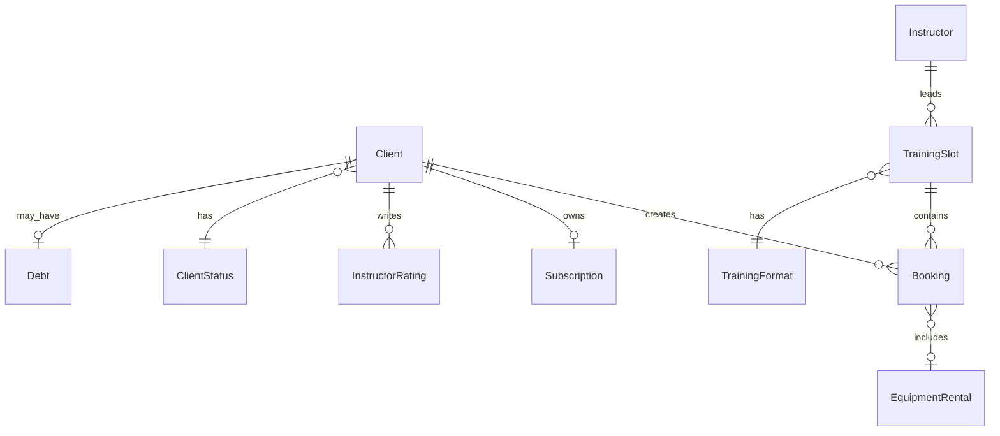
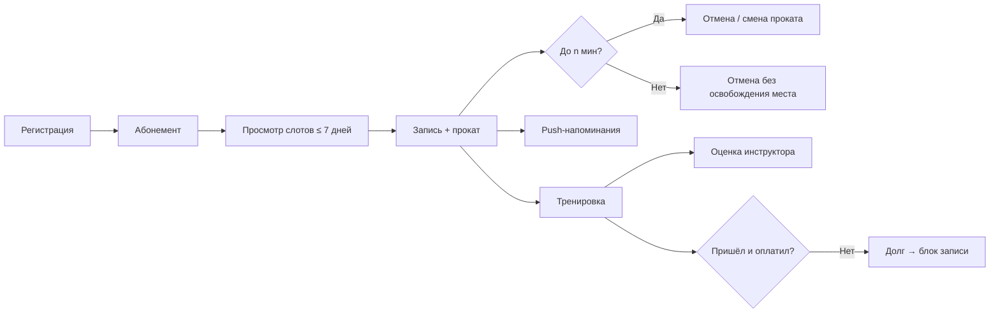

# Описание домена — клиентское приложение «Вертикаль»

> Сформировано на этапе выявления требований (`1-elicitation/`) на основе брифа
> [`0-climbing-brief/brief-climbing.md`](../0-climbing-brief/brief-climbing.md) и ответов заказчика

---

## 1. Контекст и границы системы

### Что входит в поставку

- Клиентское **мобильное приложение** (роль «Клиент»)
- **API** для клиентского приложения

### Что уже реализовано (вне скоупа)

- Бэкенд, хранение данных, формирование расписания
- Интерфейсы **инструктора** и **администратора / владельца**
- Отмена слотов по профилактике, закрытие зон
- Настройка системного параметра **`n` минут** (порог отмены и изменения проката)

### Интеграционная модель

Существующий бэкенд — **black-box источник истины**:

- Гарантия отсутствия двойных броней — на стороне сервера (атомарная проверка мест)
- Клиентское приложение полагается на **контракт API** и корректно обрабатывает отказ
- Каноническая схема данных — контракт API; исторических данных и легаси-схемы нет

### Платформа и локализация (MVP)

| Параметр | Значение |
|----------|----------|
| Платформа | **Android** |
| Язык интерфейса | **Русский** |
| Офлайн-режим | Вне MVP |

---

## 2. Акторы

| Актор | Описание |
|-------|----------|
| **Клиент** | Регистрируется, управляет абонементом, записывается на тренировки, отменяет, получает уведомления, оценивает инструкторов |
| **Инструктор** | Ведёт тренировку; для клиента — атрибут слота (имя, рейтинг) |
| **Скалодром / организатор** | Отменяет слоты, меняет время и инструктора; изменения отражаются у клиента через статусы и уведомления |
| **Администратор** | Настраивает `n` минут, управляет долгами, вручную изменяет оценки инструкторов |

---

## 3. Глоссарий

| Термин | Определение |
|--------|-------------|
| **Слот (TrainingSlot)** | Единица расписания: время, формат, инструктор, зона, места, цена |
| **Запись / бронь (Booking)** | Привязка клиента к слоту с опцией проката |
| **Формат тренировки** | Один из двух типов: болдеринг для новичков / трассы с верёвкой для опытных |
| **Прокат** | Аренда снаряжения (скальники, страховочная система — только из перечня API) |
| **Абонемент / пакет** | Пакет занятий клиента; обязательная часть MVP (детали — см. §12) |
| **`n` минут** | Настраиваемый порог до начала тренировки; задаётся в админке |
| **Долг** | Неоплаченная неявка; блокирует новые записи |
| **Статус клиента** | Поле профиля для будущей программы лояльности (без логики в MVP) |

---

## 4. Сущности домена

### 4.1. Client (Клиент)

**Идентификация и регистрация:**

- Только **зарегистрированные** пользователи
- Способы регистрации: **телефон**, **Telegram**, **email**
- **Один аккаунт на человека**; запись другого человека с чужого аккаунта не предусмотрена
- Минимальный возраст: **6 лет**

**Профиль:**

| Поле | Описание |
|------|----------|
| Имя | Отображаемое имя |
| Телефон | Контактный номер |
| Фото | Аватар пользователя |
| Статус клиента | Заложено на будущее (лояльность) |
| История записей | Список прошлых и будущих броней |

**Ограничения:**

- При наличии **активного долга** — новые записи **заблокированы** до погашения

---

### 4.2. TrainingSlot (Слот тренировки)

| Атрибут | Правило |
|---------|---------|
| Длительность | Всегда **1,5 часа** |
| Формат | Один из **двух** типов тренировок |
| Инструктор | Обязателен |
| Зона | Атрибут слота (из API) |
| Свободные места | Клиент видит **число** оставшихся мест |
| Лимит мест | До **16**; для новичковых — до **8** |
| Цена | Отображается клиенту |
| Горизонт | Слоты видны **не дальше 7 дней**; появляются **постепенно** |

**Статусы слота (со стороны клиента):**

| Статус | Описание |
|--------|----------|
| Доступен | Можно записаться |
| Отменён скалодромом | Запись на этот слот невозможна; активные брони переводятся в соответствующий статус |

---

### 4.3. Booking (Запись)

**Создание:**

- **Мгновенное** подтверждение при успешном ответе API
- **Без лимита** на количество активных записей вперёд
- Лист ожидания **не используется**

**Прокат снаряжения:**

- Выбор только из **перечня**, заданного API (скальники, страховочная система)
- Цена проката **отображается**
- При нехватке снаряжения — **предупреждение** (поведение при блокировке записи — уточняется)
- Изменение выбора проката — по тем же правилам, что и отмена (см. §5.2)

**Статусы записи:**

| Статус | Описание |
|--------|----------|
| **Подтверждена** | Активная запись на будущий слот |
| **Отменена клиентом** | Клиент отменил запись |
| **Отменена скалодромом** | Слот отменён организатором; указана **причина**; повторная запись на этот слот **запрещена** |
| **Завершена** | Тренировка состоялась |
| **No-show / долг** | Клиент не явился и не оплатил → долг, блокировка новых записей |

---

### 4.4. Subscription / Package (Абонемент)

**Приоритет MVP:** управление абонементом — один из **трёх обязательных** сценариев (наряду с записью и напоминаниями/отменами).

> **Открытые вопросы:** тип пакета (N занятий / период), момент списания, обязательность для записи — см. [`customer-questions.md`](customer-questions.md), §12.

---

### 4.5. Instructor (Инструктор)

- Привязан к слоту
- Клиент может **оценить инструктора** (не отдельную тренировку)
- При **смене инструктора** — push-уведомление клиентам с активными записями на этот слот

---

### 4.6. InstructorRating (Оценка инструктора)

| Правило | Значение |
|---------|----------|
| Формат | **Звёзды** (обязательно) + **комментарий** (опционально) |
| Авторство | Комментарий от **имени аккаунта** (не анонимно) |
| Объект | **Инструктор**, не каждая тренировка |
| Комментарий | Можно добавить **в любой момент** |
| Изменение звёзд | Только **через администратора** (после первоначальной отправки) |

---

### 4.7. Debt (Долг)

- Возникает при **неявке без оплаты**
- Блокирует возможность **новой записи** до погашения
- Детали отображения в UI — уточняются (см. [`customer-questions.md`](customer-questions.md), §13)

---

### 4.8. SystemSetting — параметр `n` минут

Настраивается в **админке** (вне клиентского приложения). Используется для:

- порога **отмены записи** клиентом
- порога **изменения выбора проката**

---

## 5. Бизнес-правила

### 5.1. Запись на тренировку

1. Доступна только **авторизованному** клиенту **без активного долга**
2. Запись **мгновенная**; при отсутствии мест — отказ API
3. Клиент видит **количество** свободных мест
4. Лист ожидания **не предусмотрен**
5. При нехватке прокатного снаряжения — **предупреждение**
6. Цены **тренировки** и **проката** отображаются в UI
7. Онлайн-оплата **не входит в MVP**; оплата на месте

### 5.2. Отмена и изменение проката (порог `n` минут)

| Момент | Отмена клиентом | Изменение проката |
|--------|-----------------|-------------------|
| **До `n` минут** до начала | Разрешена; **место освобождается** | Разрешено |
| **После `n` минут** до начала | Разрешена; место **не освобождается** для других | Не позднее `n` минут (аналогично отмене) |

### 5.3. Отмена скалодромом

1. Бронь **не удаляется** → статус **«Отменена скалодромом»** + **причина**
2. Клиент получает **push-уведомление**
3. В уведомлении — кнопка **«Записаться на другой слот»**
4. Повторная запись на **отменённый слот запрещена**

### 5.4. Изменения слота без отмены

| Событие | Поведение |
|---------|-----------|
| **Смена инструктора** | Push-уведомление; запись сохраняется |
| **Сдвиг времени начала** | Карточка **обновляется**; запись **не отменяется**; push-уведомление |

### 5.5. Неявка и долг

1. Клиент записался, **не пришёл**, **не оплатил** → фиксируется **долг**
2. До погашения долга — **новые записи недоступны**

### 5.6. Расписание

1. Клиент видит слоты **не дальше 7 дней** от текущего момента
2. Слоты появляются **постепенно** (не обязательно всей неделей)
3. При отсутствии слотов — **empty state**: «Пока нет доступных тренировок»

---

## 6. Уведомления

### 6.1. Push-уведомления (MVP)

| Событие | Обязательно |
|---------|-------------|
| Напоминание о предстоящей тренировке | Да; **время задаёт клиент** |
| Отмена записи скалодромом | Да; с кнопкой «Записаться на другой слот» |
| Изменение времени начала | Да |
| Смена инструктора | Да |
| Напоминание об оценке инструктора | Да |

### 6.2. Email

- Дублирование уведомлений на **email**, если адрес указан в профиле

### 6.3. Вне MVP

- SMS
- Push о подтверждении записи (не указано заказчиком как обязательное)

---

## 7. Сценарии MVP

**Без этих сценариев сезон «не взлетит» (по заказчику):**

1. **Запись на занятие** — просмотр слотов, выбор проката, мгновенная бронь
2. **Управление абонементом** — пакет занятий и связь с записями
3. **Напоминания и управление отменами** — push/email, отмена с учётом `n` минут

**Дополнительные сценарии MVP:**

4. Регистрация и профиль клиента
5. Реакция на действия скалодрома (отмена, смена инструктора/времени)
6. Оценка инструкторов (звёзды + комментарий)
7. Контроль долга за неявку
8. Отображение цен (без онлайн-оплаты)

---

## 8. Вне MVP (отложено)

| Область | Решение |
|---------|---------|
| Программа лояльности | Поле **статус клиента** в профиле; логика позже |
| iOS | Позже |
| Офлайн-режим | Позже |
| Мультиязычность | Позже |
| Фильтр по инструктору | Позже |
| Онлайн-оплата | Позже |
| Лист ожидания | Не планируется |

---

## 9. Диаграмма связей сущностей

---

## 10. Диаграмма основного потока (клиент)

---

## 11. Открытые вопросы

Детали, требующие следующего раунда с заказчиком — в [`customer-questions.md`](customer-questions.md):

- §12 — абонемент / пакет занятий
- §13 — отображение и погашение долга
- §14 — уточнение по оценкам и предупреждению о прокате

---

## 12. Связанные документы

| Документ | Описание |
|----------|----------|
| [`0-climbing-brief/brief-climbing.md`](../0-climbing-brief/brief-climbing.md) | Исходный бриф заказчика |
| [`customer-questions.md`](customer-questions.md) | Вопросы для заказчика |
| [`../../README.md`](../../README.md) | Обзор проекта |
