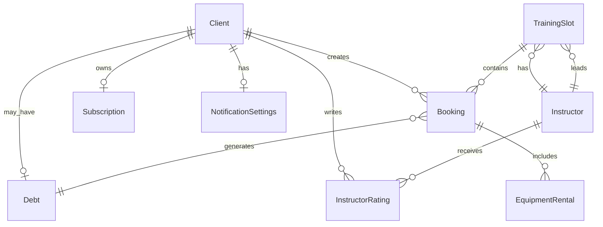

# Модель данных — Клиентское приложение «Вертикаль»

> **Назначение:** Описание сущностей, их атрибутов, связей и прав доступа. Модель отражает данные, с которыми работает клиентское приложение, и их происхождение.
>
> **Источники:** `domain-description.md`, `functional-requirements.md`, `business-requirements.md`
>
> **Принципы моделирования:**
> - Бэкенд — **black-box источник истины** (R-004)
> - Приложение **потребляет** данные через API, но не создаёт и не редактирует слоты, инструкторов, зоны
> - Приложение **создаёт и изменяет** записи (брони), оценки, настройки уведомлений
> - Каноническая схема — **контракт API** (R-015)

---

## Легенда

| Обозначение | Смысл |
|-------------|-------|
| **📖 Только чтение** | Сущность поступает из бэкенда; клиентское приложение только отображает |
| **✏️ Чтение + запись** | Клиентское приложение может создавать и изменять сущность |
| **🔗 Ссылка** | Сущность ссылается на другую сущность по ID |
| **P0** | Критично для MVP |
| **P1** | Важно для MVP |

---

## 1. Клиент (Client)

> **Тип доступа:** ✏️ Чтение + запись (создаётся при регистрации, обновляется в профиле)
> **Приоритет:** P0
> **Источник:** §4.1 domain-description.md

### Атрибуты

| Атрибут | Тип | Обязательный | Описание |
|---------|-----|--------------|----------|
| `id` | UUID | Да | Уникальный идентификатор клиента |
| `phone` | String | Да | Номер телефона (формат +7XXXXXXXXXX) |
| `telegramId` | String | Нет | ID в Telegram (если регистрация через Telegram) |
| `email` | String | Нет | Email (если указан) |
| `name` | String | Да | Отображаемое имя клиента |
| `birthDate` | Date | Да | Дата рождения (для проверки возраста ≥ 6 лет) |
| `photo` | String (URL) | Нет | Ссылка на фото/аватар |
| `clientStatus` | String | Нет | Статус клиента (для будущей лояльности, без логики в MVP) |
| `hasDebt` | Boolean | Да | Флаг активного долга |
| `createdAt` | DateTime | Да | Дата создания аккаунта |
| `updatedAt` | DateTime | Да | Дата последнего обновления |

### Связи

| Связь | Тип | Сущность | Описание |
|-------|-----|----------|----------|
| `client.bookings` | one-to-many | Booking | Записи клиента на тренировки |
| `client.subscription` | one-to-one | Subscription | Абонемент/пакет занятий клиента |
| `client.ratings` | one-to-many | InstructorRating | Оценки, оставленные клиентом инструкторам |
| `client.debt` | one-to-one | Debt | Долг клиента (если есть) |

---

## 2. Слот тренировки (TrainingSlot)

> **Тип доступа:** 📖 Только чтение (поступает из бэкенда)
> **Приоритет:** P0
> **Источник:** §4.2 domain-description.md

### Атрибуты

| Атрибут | Тип | Обязательный | Описание |
|---------|-----|--------------|----------|
| `id` | UUID | Да | Уникальный идентификатор слота |
| `startTime` | DateTime | Да | Время начала тренировки |
| `endTime` | DateTime | Да | Время окончания (всегда startTime + 1.5 часа) |
| `duration` | Integer | Да | Длительность в минутах (всегда 90) |
| `format` | TrainingFormat | Да | Формат тренировки (enum) |
| `instructorId` | UUID | Да | ID инструктора |
| `instructorName` | String | Да | Имя инструктора (для быстрого отображения) |
| `zone` | String | Да | Название зоны (например, «Стена А») |
| `totalSpots` | Integer | Да | Общее количество мест (8 или 16) |
| `availableSpots` | Integer | Да | Количество свободных мест |
| `price` | Decimal | Да | Цена тренировки в рублях |
| `status` | SlotStatus | Да | Статус слота (enum) |
| `cancellationReason` | String | Нет | Причина отмены (если статус = CANCELLED_BY_GYM) |
| `equipmentRentalOptions` | Array | Нет | Доступные позиции проката с ценами |

### Перечисления

#### TrainingFormat

| Значение | Описание |
|----------|----------|
| `BOULDERING_BEGINNER` | Болдеринг для новичков (лимит 8 мест) |
| `ROPE_ADVANCED` | Трассы с верёвкой для опытных (лимит 16 мест) |

#### SlotStatus

| Значение | Описание |
|----------|----------|
| `AVAILABLE` | Слот доступен для записи |
| `CANCELLED_BY_GYM` | Слот отменён скалодромом (недоступен для записи) |

### Связи

| Связь | Тип | Сущность | Описание |
|-------|-----|----------|----------|
| `slot.bookings` | one-to-many | Booking | Записи на этот слот |
| `slot.instructor` | many-to-one | Instructor | Инструктор, ведущий тренировку |

---

## 3. Запись / Бронь (Booking)

> **Тип доступа:** ✏️ Чтение + запись (создаётся клиентом, отменяется клиентом)
> **Приоритет:** P0
> **Источник:** §4.3 domain-description.md

### Атрибуты

| Атрибут | Тип | Обязательный | Описание |
|---------|-----|--------------|----------|
| `id` | UUID | Да | Уникальный идентификатор записи |
| `clientId` | UUID | Да | ID клиента |
| `slotId` | UUID | Да | ID слота тренировки |
| `status` | BookingStatus | Да | Статус записи (enum) |
| `equipmentRental` | EquipmentRental | Нет | Выбранный прокат снаряжения |
| `totalPrice` | Decimal | Нет | Итоговая цена (тренировка + прокат) |
| `cancellationReason` | String | Нет | Причина отмены (если отменено скалодромом) |
| `createdAt` | DateTime | Да | Дата создания записи |
| `updatedAt` | DateTime | Да | Дата последнего обновления |
| `cancelledAt` | DateTime | Нет | Дата отмены (если отменена) |

### Перечисления

#### BookingStatus

| Значение | Описание | Отображается как |
|----------|----------|------------------|
| `CONFIRMED` | Активная запись на будущий слот | «Подтверждена» 🟢 |
| `CANCELLED_BY_CLIENT` | Клиент отменил запись | «Отменена клиентом» ⚪ |
| `CANCELLED_BY_GYM` | Слот отменён скалодромом | «Отменена скалодромом» ⚪ |
| `COMPLETED` | Тренировка состоялась | «Завершена» 🔵 |
| `NO_SHOW` | Клиент не явился и не оплатил | «No-show / долг» 🔴 |

### Связи

| Связь | Тип | Сущность | Описание |
|-------|-----|----------|----------|
| `booking.client` | many-to-one | Client | Клиент, создавший запись |
| `booking.slot` | many-to-one | TrainingSlot | Слот, на который запись |

---

## 4. Прокат снаряжения (EquipmentRental)

> **Тип доступа:** ✏️ Чтение + запись (выбирается клиентом при записи)
> **Приоритет:** P0
> **Источник:** §4.3 domain-description.md

### Атрибуты

| Атрибут | Тип | Обязательный | Описание |
|---------|-----|--------------|----------|
| `id` | UUID | Да | Уникальный идентификатор |
| `bookingId` | UUID | Да | ID записи, к которой относится прокат |
| `rentalOption` | RentalOption | Да | Тип проката (enum) |
| `quantity` | Integer | Да | Количество (1 или более) |
| `pricePerUnit` | Decimal | Да | Цена за единицу |
| `totalPrice` | Decimal | Да | Итоговая стоимость проката |

### Перечисления

#### RentalOption

| Значение | Описание |
|----------|----------|
| `SHOES` | Скальники |
| `HARNESS` | Страховочная система |

### Связи

| Связь | Тип | Сущность | Описание |
|-------|-----|----------|----------|
| `rental.booking` | many-to-one | Booking | Запись, к которой относится прокат |

---

## 5. Абонемент / Пакет занятий (Subscription)

> **Тип доступа:** 📖 Только чтение (данные из бэкенда)
> **Приоритет:** P0
> **Источник:** §4.4 domain-description.md

### Атрибуты

| Атрибут | Тип | Обязательный | Описание |
|---------|-----|--------------|----------|
| `id` | UUID | Да | Уникальный идентификатор абонемента |
| `clientId` | UUID | Да | ID клиента, владеющего абонементом |
| `totalSessions` | Integer | Да | Общее количество занятий в пакете |
| `usedSessions` | Integer | Да | Использовано занятий |
| `remainingSessions` | Integer | Да | Осталось занятий (total - used) |
| `startDate` | Date | Да | Дата активации абонемента |
| `endDate` | Date | Да | Дата окончания действия |
| `status` | SubscriptionStatus | Да | Статус абонемента (enum) |
| `purchaseDate` | Date | Да | Дата покупки |

### Перечисления

#### SubscriptionStatus

| Значение | Описание |
|----------|----------|
| `ACTIVE` | Абонемент активен, есть занятия |
| `EXPIRED` | Срок действия истёк |
| `EXHAUSTED` | Все занятия использованы |

### Связи

| Связь | Тип | Сущность | Описание |
|-------|-----|----------|----------|
| `subscription.client` | one-to-one | Client | Клиент, владеющий абонементом |

---

## 6. Инструктор (Instructor)

> **Тип доступа:** 📖 Только чтение (поступает из бэкенда)
> **Приоритет:** P0
> **Источник:** §4.5 domain-description.md

### Атрибуты

| Атрибут | Тип | Обязательный | Описание |
|---------|-----|--------------|----------|
| `id` | UUID | Да | Уникальный идентификатор инструктора |
| `name` | String | Да | Имя инструктора |
| `photo` | String (URL) | Нет | Фото инструктора |
| `rating` | Decimal | Нет | Средний рейтинг (вычисляется из оценок) |
| `ratingCount` | Integer | Нет | Количество оценок |
| `specialization` | String | Нет | Специализация (опционально) |

### Связи

| Связь | Тип | Сущность | Описание |
|-------|-----|----------|----------|
| `instructor.slots` | one-to-many | TrainingSlot | Слоты, которые ведёт инструктор |
| `instructor.ratings` | one-to-many | InstructorRating | Оценки инструктора |

---

## 7. Оценка инструктора (InstructorRating)

> **Тип доступа:** ✏️ Чтение + запись (создаётся клиентом)
> **Приоритет:** P1
> **Источник:** §4.6 domain-description.md

### Атрибуты

| Атрибут | Тип | Обязательный | Описание |
|---------|-----|--------------|----------|
| `id` | UUID | Да | Уникальный идентификатор оценки |
| `clientId` | UUID | Да | ID клиента, оставившего оценку |
| `instructorId` | UUID | Да | ID инструктора |
| `stars` | Integer | Да | Оценка звёздами (1-5) |
| `comment` | String | Нет | Текстовый комментарий (макс 500 символов) |
| `createdAt` | DateTime | Да | Дата создания оценки |
| `updatedAt` | DateTime | Да | Дата последнего обновления |

### Правила

- Клиент может оценить инструктора **один раз**
- Звёзды **нельзя изменить** после отправки (только через администратора)
- Комментарий можно **добавить/изменить** в любой момент

### Связи

| Связь | Тип | Сущность | Описание |
|-------|-----|----------|----------|
| `rating.client` | many-to-one | Client | Клиент, оставивший оценку |
| `rating.instructor` | many-to-one | Instructor | Оцениваемый инструктор |

---

## 8. Долг (Debt)

> **Тип доступа:** 📖 Только чтение (управляется администратором в бэкенде)
> **Приоритет:** P1
> **Источник:** §4.7 domain-description.md

### Атрибуты

| Атрибут | Тип | Обязательный | Описание |
|---------|-----|--------------|----------|
| `id` | UUID | Да | Уникальный идентификатор долга |
| `clientId` | UUID | Да | ID клиента |
| `bookingId` | UUID | Да | ID записи, по которой возник долг |
| `amount` | Decimal | Да | Сумма долга в рублях |
| `reason` | String | Да | Причина возникновения долга |
| `status` | DebtStatus | Да | Статус долга (enum) |
| `createdAt` | DateTime | Да | Дата возникновения долга |
| `resolvedAt` | DateTime | Нет | Дата погашения долга |

### Перечисления

#### DebtStatus

| Значение | Описание |
|----------|----------|
| `OPEN` | Долг активен, блокирует запись |
| `PAID` | Долг оплачен, запись разблокирована |
| `RESOLVED` | Долг урегулирован иным способом |

### Связи

| Связь | Тип | Сущность | Описание |
|-------|-----|----------|----------|
| `debt.client` | one-to-one | Client | Клиент, имеющий долг |
| `debt.booking` | one-to-one | Booking | Запись, по которой возник долг |

---

## 9. Настройки уведомлений (NotificationSettings)

> **Тип доступа:** ✏️ Чтение + запись (настраивается клиентом)
> **Приоритет:** P1
> **Источник:** §6.1 domain-description.md

### Атрибуты

| Атрибут | Тип | Обязательный | Описание |
|---------|-----|--------------|----------|
| `clientId` | UUID | Да | ID клиента |
| `reminderTimeMinutes` | Integer | Да | За сколько минут напоминать о тренировке (дефолт: 120) |
| `emailEnabled` | Boolean | Да | Включено ли дублирование на email |
| `pushEnabled` | Boolean | Да | Включены ли push-уведомления (управляется через ОС) |
| `updatedAt` | DateTime | Да | Дата последнего обновления настроек |

### Связи

| Связь | Тип | Сущность | Описание |
|-------|-----|----------|----------|
| `settings.client` | one-to-one | Client | Клиент, владеющий настройками |

---

## 10. Системный параметр (SystemParameter)

> **Тип доступа:** 📖 Только чтение (настраивается в админке бэкенда)
> **Приоритет:** P0
> **Источник:** §4.8 domain-description.md

### Атрибуты

| Атрибут | Тип | Обязательный | Описание |
|---------|-----|--------------|----------|
| `key` | String | Да | Ключ параметра |
| `value` | String | Да | Значение параметра |
| `description` | String | Нет | Описание параметра |

### Известные параметры

| Ключ | Описание | Пример значения |
|------|----------|-----------------|
| `CANCELLATION_THRESHOLD_MINUTES` | Порог `n` минут для отмены и изменения проката | `120` |

---

## Сводка по доступу

| Сущность | Тип доступа | Создание | Чтение | Обновление | Удаление |
|----------|-------------|----------|--------|------------|----------|
| **Client** | ✏️ Чтение + запись | При регистрации | Да | В профиле | Нет |
| **TrainingSlot** | 📖 Только чтение | Бэкенд | Да | Нет | Нет |
| **Booking** | ✏️ Чтение + запись | При записи | Да | Отмена, прокат | Нет (soft delete) |
| **EquipmentRental** | ✏️ Чтение + запись | При записи | Да | При изменении | Нет |
| **Subscription** | 📖 Только чтение | Бэкенд | Да | Нет | Нет |
| **Instructor** | 📖 Только чтение | Бэкенд | Да | Нет | Нет |
| **InstructorRating** | ✏️ Чтение + запись | Клиент | Да | Только комментарий | Нет |
| **Debt** | 📖 Только чтение | Бэкенд | Да | Нет | Нет |
| **NotificationSettings** | ✏️ Чтение + запись | При регистрации | Да | Да | Нет |
| **SystemParameter** | 📖 Только чтение | Бэкенд | Да | Нет | Нет |

---

## Диаграмма связей (ER)

## Связанные файлы

| Файл | Описание |
|------|----------|
| `api-sequence.md` | Sequence-диаграммы API-вызовов |
| `functional-requirements.md` | Функциональные требования |
| `domain-description.md` | Описание домена |
